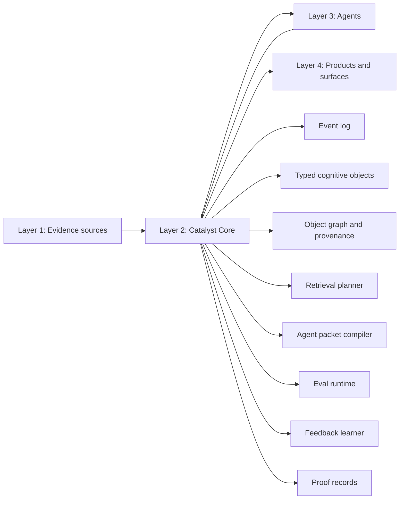
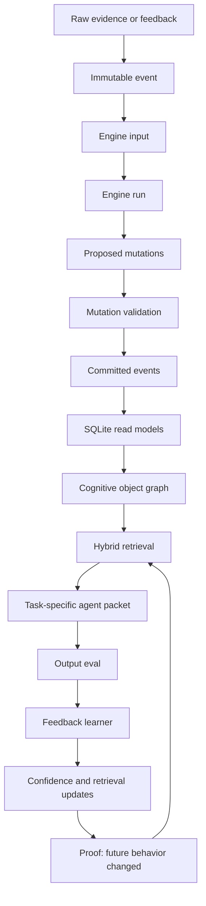
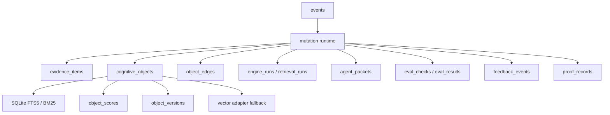
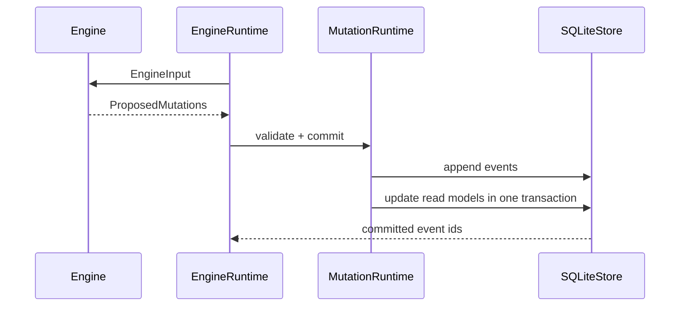
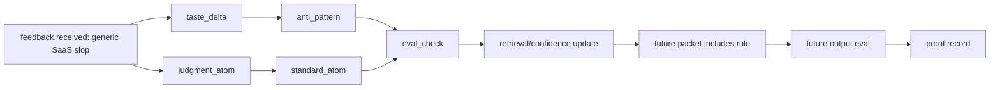

# Catalyst Core

Catalyst is a cognitive kernel for AI agents.

It is not a dashboard, prompt pack, RAG wrapper, hosted memory toy, CLI onboarding flow, or markdown brain generator. Catalyst Core is Layer 2 infrastructure: an event-sourced object graph that turns evidence and feedback into durable memory, taste, judgment, retrieval behavior, eval checks, and proof that future behavior changed.

The core claim is simple:

```txt
An agent system is not meaningfully personalized until feedback changes future behavior.
```

Catalyst makes that testable.

## What Catalyst Owns

Catalyst Core owns the mechanism below. Everything else is a client.



Layer 1 provides evidence. Layer 3 consumes packets and returns outputs or feedback. Layer 4 observes or controls. None of those layers owns memory, judgment, retrieval, evals, or feedback learning.

## Core Operating Loop



The kernel is intentionally headless and Python-first. No React, no product onboarding, no MCP product surface, no local dashboard state.

## Storage Architecture

The SQLite event store is the canonical local state. JSONL and markdown are export formats only.



Required tables include:

```txt
events
artifacts
evidence_items
cognitive_objects
object_edges
engine_runs
proposed_mutations
retrieval_runs
agent_packets
eval_checks
eval_results
feedback_events
proof_records
object_scores
object_versions
```

## Cognitive Objects

Objects are not notes. They are structured units with scope, evidence, confidence, source strength, usage, success, failure, and provenance.

Object types:

```txt
memory_atom
taste_delta
judgment_atom
identity_atom
context_atom
standard_atom
anti_pattern
eval_check
reference_item
retrieval_policy
agent_packet
proof_record
```

Memory families:

```txt
episodic
semantic
procedural
preference
negative
reference
social/customer
strategic
```

Graph edges:

```txt
extracted_from
supports
contradicts
refines
consolidates
scoped_to
retrieved_for
compiled_into
evaluated_by
updated_by
improved_by
```

## Engine Contract

Engines do not write state.



The 12 engines:

1. Evidence Normalization
2. Signal Extraction
3. Memory Formation
4. Taste Modeling
5. Judgment Modeling
6. Identity Modeling
7. Context State
8. Consolidation
9. Contradiction / Scope
10. Retrieval Planning
11. Packet Compilation
12. Eval + Feedback Learning

## Retrieval Is Not Basic RAG

Retrieval combines:

```txt
symbolic filters
SQLite FTS5 / BM25
vector adapter fallback
graph traversal
recency
scope and audience match
confidence
source strength
past usefulness
negative constraints
eval relevance
```

Each retrieval run returns a trace: why an object was selected, which evidence supports it, which evals depend on it, and what was excluded.

## Feedback Learning Loop

Example: the user rejects output as "generic SaaS slop."



The next similar packet must include the new anti-pattern and standard. The next eval must catch the repeated failure. A proof record links before packet -> feedback -> after packet.

## Minimal Python Usage

```python
from catalyst_core import CatalystCore

core = CatalystCore("core.sqlite3")

before = core.compile_packet("Write Catalyst landing page copy", project="catalyst")

core.receive_feedback(
    before["packet"]["id"],
    "Our platform helps teams unlock productivity with seamless AI workflows.",
    "Reject this as generic SaaS slop. Show taste, judgment, retrieval, eval, and feedback learning.",
    project="catalyst",
)

after = core.compile_packet("Write better Catalyst landing page copy", project="catalyst")
review = core.evaluate_output(
    after["packet"]["id"],
    "Catalyst helps teams unlock productivity with seamless AI workflows.",
    project="catalyst",
)

assert "generic SaaS slop" in after["packet"]["packet"]
assert review["verdict"] in {"revise", "reject"}
```

## Verification

Run:

```bash
python -m pytest
python evals/run_all.py
```

The north-star acceptance test is:

```txt
test_feedback_changes_future_packet()
```

It proves feedback changes future retrieval, packet contents, eval behavior, and proof records. If that test fails, Catalyst Core has failed its own reason to exist.

## Current Boundary

This repo is now the foundation layer only.

No UI. No consumer onboarding. No hosted backend. No MCP product flow. No markdown brain as source of truth. Those can exist later as clients, but they do not define Catalyst Core.
