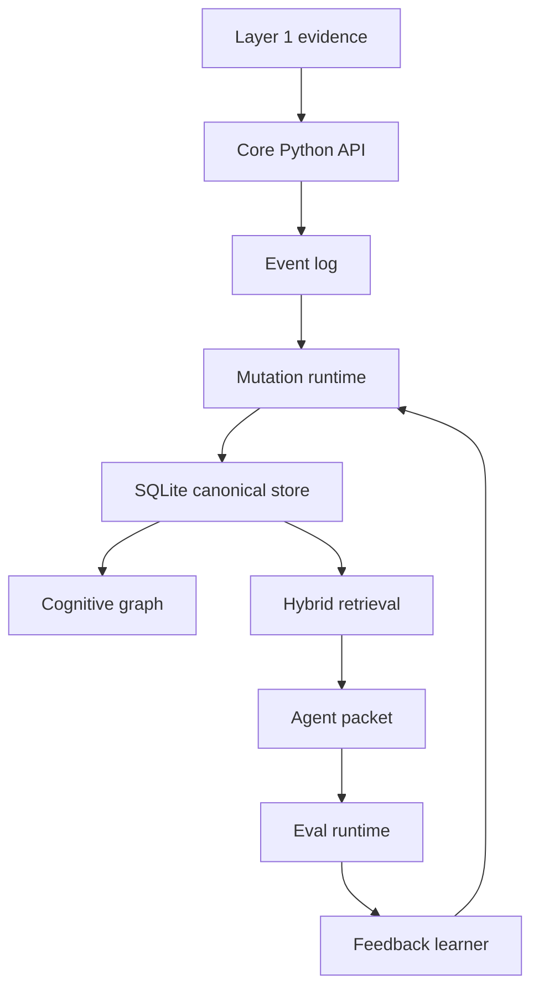

# Catalyst Core Architecture

Catalyst Core is Layer 2: the cognitive kernel between evidence sources and agents.

The core implementation is split into:

- `domain/`: typed contracts
- `storage/`: SQLite, graph, FTS, vector fallback, artifacts
- `kernel/`: event log, mutation runtime, retrieval, packet, eval, feedback, proof
- `engines/`: engine contracts and concrete proposers
- `policies/`: scoring, confidence, decay, consolidation, contradiction
- `api/`: Python service boundary

Design laws:

- SQLite is canonical local state.
- Every state change starts as an immutable event.
- Engines propose mutations and never write directly.
- JSONL and markdown are exports only.
- UI, CLI, MCP, and hosted surfaces are clients.

